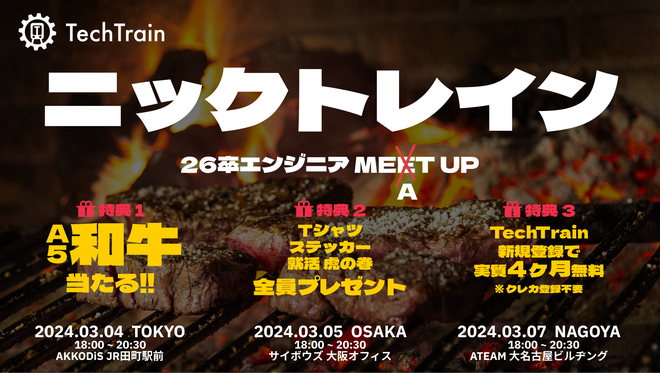

<!-- https://qiita.com/takeshisakuma/items/5a61e6eac123d28602fb -->
# コミュニティイベントのアンチパターン

---

<!-- _class: lead -->
<!-- _footer: "" -->
<!-- _paginate: "" -->

# 自己紹介

---

### 所属

- 株式会社TechBowl

### 職種

- Webエンジニア

### 趣味

- お酒
- サウナ
- 読書

---

## TechTrain

エンジニア教育・コミュニティ

---

# さて！

---

# コミュニティイベントのアンチパターン

---

# コミュニティの前提

---

# コミュニティの前提

1. 約1万人の参加者
2. 主にエンジニアを対象とするコミュニティ
3. 学生と社会人の割合は半々程度
4. テキストコミュニケーションはSlackを利用
5. イベントの開催頻度は不定期

---

# アンチパターンリスト

1. 大阪を無視すると怖いぞ？
2. 幕の内弁当は美味しいね？
3. シークレットってロマンが詰まってる?

---

# アンチパターン1: 大阪を無視すると怖いぞ？

---

# アンチパターン1: 大阪を無視すると怖いぞ？

地域性を考慮しよう

---

# 同じイベント構成を東京、名古屋、大阪で行った場合、どうなるでしょうか？

---

# 同じイベントなのに、全く異なる状況となります・・・！

---

# 地域性による違い

| 地域 | 盛り上がりやすさ |
|:---:|:---|
| 東京 | コンテンツがないと盛り上がらない |
| 名古屋 | コミュニティが狭いため、参加者同士の関係性が強く、イベント自体が盛り上がりやすい |
| 大阪 | 自発的な交流が盛んで、自然とイベントが活気づく |

西へ向かうほど、声の大きさやイベントの進行が時間通りにいかなくなる傾向があります。

---

# 対策: 盛り上がり用のコンテンツなどを地域特性によって用意する

---

# 対策: 盛り上がり用のコンテンツなどを地域特性によって用意する

※ 西の方には必要ないことが多い・・・笑

---

# アンチパターン2: 幕の内弁当は美味しいね？

---

# 先日こんなイベントをやらせていただきました！

---

---

# 26卒の学生エンジニアが入り混じってお肉を食べるイベント

---

# 最初の目的

26卒の学生エンジニアに "今" コードを書くことの就活における重要性を理解してもらう

---

# 目的に対する背景

- インターンと就職活動で評価してもらうのに十分な量のアウトプットをするには今から始めないと遅い
- 過去のしくじりを聞いてもらい、同じ失敗を繰り返さないようにしてもらいたい
- 25卒の先輩と26卒同士の交流機会の提供によるモチベーションの向上でコードを書いてもらえそう

---

# 話が進むと

- 24卒や27卒の話も聞いた方が良い？
- メンターにも登壇してもらった方が良い？
- 26卒の参加者自身も発表した方が良い?

---

# そのまま作るとイベントの構成はどうなるのか？

---

- オープニング
- メンターの登壇
- 25卒の登壇
- 26卒の登壇
- 27卒の登壇
- 交流会

---

# 平日の夜にやるには時間が足りないし、これで26卒のエンジニアにコードを書く重要性は伝わるのか・・・？

---

# 施策が分散してしまう

---

# 当初の目的としてやるべきこと

---

# 26卒の方々にコードを書いてもらえるようになるために必要なこと

<!-- ここで当初の目的を思い出してみると -->

---

# 26卒の方々にコードを書いてもらえるようになるために必要なこと

1. 今の時期書いていないことによる不利感の醸成
2. 似たくらいの人を見て、自分も書かねば！というモチベーションの向上
3. アウトプットの重要性を理解してもらう

---

- 24卒や27卒の話も聞いた方が良い？ → **27卒は就活に関連が薄く、24卒は、26卒にとって少し遠い**
- メンターにも登壇してもらった方が良い？ → **メンターは存在が遠すぎる**
- 26卒の参加者自身も発表した方が良い? → **必要なアウトプットは登壇よりもまずコードを書くことのほうが確率が高い**

---

# イベント構成

---

- オープニング → 就活時期などの必要情報の提供
- 25卒の登壇 → しくじり談などを聞く
- 交流会 → 同期との交流で刺激を受ける

---

# コンテンツの幕の内弁当をやめよう！（美味しいけど）

---

# アンチパターン3: シークレットってロマンが詰まってる?

---

# アンチパターン3: シークレットってロマンが詰まってる

イベントの概要をちゃんと公開しよう

---

# シークレットにしがちなものの例

* ゲスト
* プレゼント
* コンテンツ

---

# これによって実際にTechTrainで起きた機会損失

---

1. 普段参加してくれる人な参加申し込みしなかった
2. 参加者が友人を誘わなかった
3. ゲストに対する事前の質問を考えられなかった

---

# コミュニティのユーザーから実際に出た声

1. 事前に知っていれば、友人も参加できたのに！
2. 事前に知っていれば、ゲストの専門分野について質問できたのに！
3. 事前に知らないので、そもそも参加を渋った人がいる

---

このような期待とのズレから、厳しいフィードバックを受けることになります。

---

# 対策: 事前に共有できることを共有すること

<!-- シークレットゲストなどのサプライズなくとも期待値を上回るイベント設計をすることで十分達成できる。必要なサプライズとは、期待値を上回る方の良いサプライズが良い -->

---

# まとめ

1. 大阪を無視すると怖いから、地域によって時間配分や進行のやり方を考慮しよう！
2. 幕の内弁当は美味しいけど、コンテンツの幕の内弁当はやめよう！
3. シークレットにはロマンは詰まってない。公開しよう！

---

# ご静聴ありがとうございました！

---
