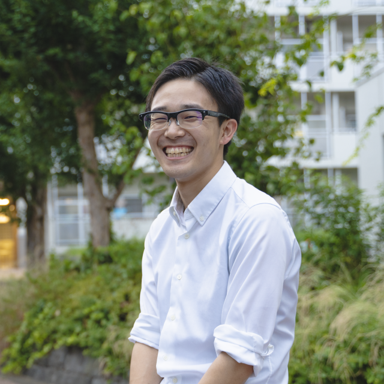

<!-- https://qiita.com/takeshisakuma/items/5a61e6eac123d28602fb -->
#

---

<!-- _class: lead -->
<!-- _footer: "" -->
<!-- _paginate: "" -->

# 自己紹介

---

### 所属

株式会社TechBowl

### 住んでるところ

東京

### 何やってる？

「TechTrain」というサービスで反復横跳びし続けている何でも屋さん(Laravel, Next.js, AWS, etc...)

### 趣味

 - お酒(よく溺れる)
 - サウナ
 - 読書

---

## TechTrain

エンジニア教育+Directスカウトのサービス。

---

# さて！

---

# コミュニティイベントのアンチパターン

---

#

- 当日発表系のシークレットゲスト、もの、ギフトは事前に知っておけば、友達呼べたのに！が大量に出てくるのでやめよう
- イベントの目的が幕の内弁当になりがち問題
  - 26卒の
  - 新規獲得とかは狙うなと
  - 25卒も呼んだ方が良い
  - メンター

---
