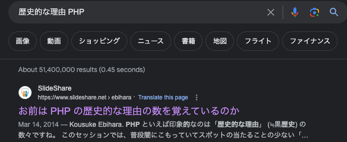
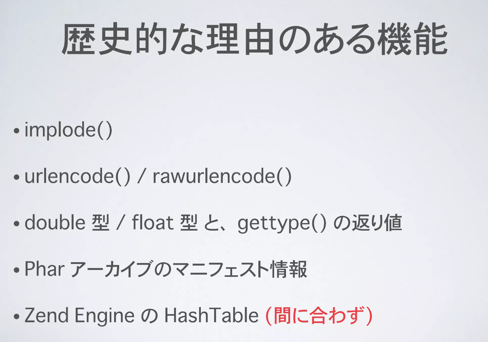
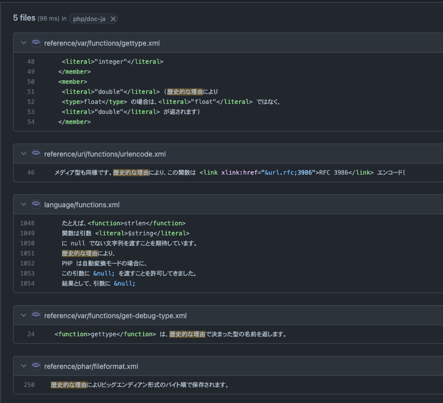
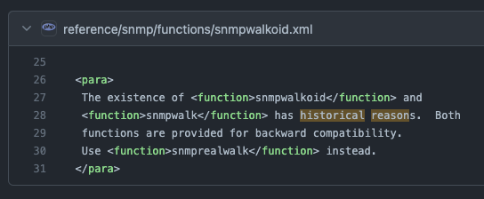
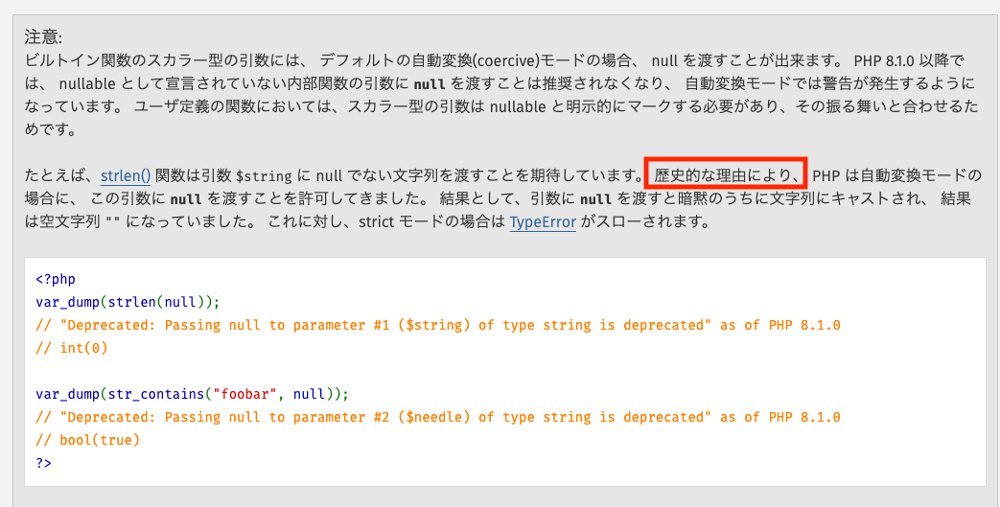
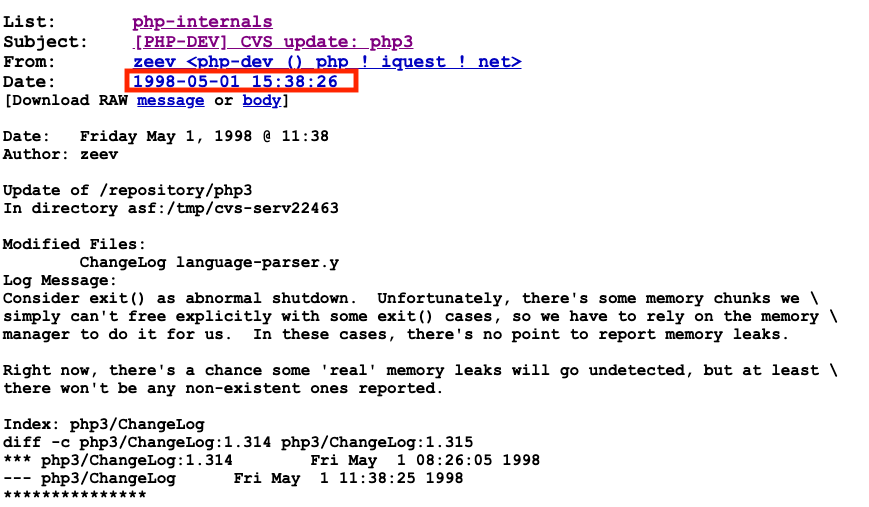
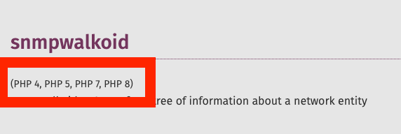

<!-- https://qiita.com/takeshisakuma/items/5a61e6eac123d28602fb -->
# PHPの「歴史的な理由」ってなんだ！？

---

<!-- _class: lead -->
<!-- _footer: "" -->
<!-- _paginate: "" -->

# 自己紹介

---

### 所属

株式会社TechBowl

### 住んでるところ

東京

### 何やってる？

「TechTrain」というサービスで反復横跳びし続けている何でも屋さん(Laravel, Next.js, AWS, etc...)

### 趣味
 - お酒(よく溺れる)
 - サウナ
 - 読書

---

## TechTrain

エンジニア教育+Directスカウトのサービス。
Coding Stoicをテーマに「うるせえコードかけ！」と言いがちなメンターが多めのエンジニアを育てるためのサービスです。

---

# なぜ発表しようと思ったのか？

---

1. PHPの言語にディープダイブしていきたい
2. 歴史を遡っていけば、いいんじゃないかという仮説を持った
3.

---

# さて！

---

# PHPの「歴史的な理由」ってなんだ！？

---

# 今回初めてCFPを出させてもらったわけですが、、、

---

---

---

---

# 過去の発表がすでにあった・・・

確認してから応募しろ・・・

---

# ここで解説されているものは何か？

---

---

# 現在のphp.netにおける「歴史的な理由」の数は？

---

---

# 5つ！

---

# 過去の発表と被ってないものは実質1つだけ！？(ユーザー定義関数)

---

# 他にないのか・・・！？

---

# [GitHubで再度「英語で」検索](https://github.com/search?q=repo%3Aphp%2Fdoc-en%20historical%20reason&type=code)をしてみました

---

# ん？

---

# 日本語ドキュメントの検索では引っかからないやつ！

---

# 一安心ということで、次の2つを遡っていきます！

---

## 1. ユーザー定義関数
## 2. snmpwalkoid

---

# どうやって歴史を追うのか？について

---

## 歴史を追うのに利用する情報源

1. [PHPのRFCの履歴(PHP5.3~有効)](https://wiki.php.net/rfc)を読む
2. [php-srcのGitHubのソースコード](https://github.com/php/php-src)のcommitを遡って見る(PHP4.0~有効)
3. [PHP Internals](https://www.php.net/mailing-lists.php)(PHP3.0~から有効)
4. [museum.php.net](https://museum.php.net)でphp-srcのソースコードをダウンロードして見る(PHP1~)

---

# それでは早速追っていきましょう。

---

## [1. 内部（ビルトイン）関数](https://www.php.net/manual/ja/functions.internal.php#:~:text=For%20historical%20reasons%2C%20PHP%20allows,as%20of%20PHP%208.1.0)

---

---

> Historically, the reason for this discrepancy is that internal functions have supported a concept of scalar types (bool, int, float, string) long before they were introduced for user-defined functions in PHP 7.0, and the existing implementation silently accepted null values. For the new scalar type declarations introduced in PHP 7.0 an explicit choice was made to not accept null values to non-nullable arguments, but changing the existing behavior of internal functions would have been too disruptive at the time.

[PHP RFC: Deprecate passing null to non-nullable arguments of internal functions](https://wiki.php.net/rfc/deprecate_null_to_scalar_internal_arg)

---

> 歴史的に見ると、この不一致の原因は、内部関数が PHP 7.0 でユーザー定義関数に導入されるずっと前から スカラー型 (bool, int, float, string) の概念をサポートしており、 既存の実装では null 値を黙って受け取っていたからです。PHP 7.0 で導入された新しいスカラー型の宣言では、null 値を受け取らないようにすることが明示的に選択されましたが、 内部関数の既存の振る舞いを変更することは、その時点ではあまりに破壊的でした。この RFC では、PHP 8.1 で非推奨の警告を発生させ、内部関数の挙動を同期させることを提案しています。

[PHP RFC: Deprecate passing null to non-nullable arguments of internal functions](https://wiki.php.net/rfc/deprecate_null_to_scalar_internal_arg)

---

|種類|nullに対する対応|
|:--|---|
|ユーザー定義関数|PHP7.0から導入され、nullを受け取る場合とそうではない場合が最初から区別されていた|
|内部関数|PHP7.0はるか以前からnullを黙って受け取っていた|

知っての通り、PHP8.1からは、内部関数もstrictモードの際には、ユーザー定義関数と同じように明示されているnullableの引数以外は、nullを受け取ることができなくなっています。

---

# ちなみにscalarというワードがいつからあるのか？を遡ってみると

---

---

# [1998年！](https://marc.info/?l=php-internals&m=90222483131759&w=2)

---

# これは確かに歴史的な理由ですね・・・。

---

## どのバージョンからなぜnullが暗黙的に受け取られていたのか？については、遡ってみたものの判明せず、迷宮入りでした・・・

力及ばずごめんなさい・・・

---

# それでは2つ目。

---

## [2. snmpwalkoid](https://www.php.net/manual/en/function.snmpwalkoid)

---

# そもそも見たことがない関数では・・・。

---

# 見たことがある方いらっしゃいますかー！

---

## 具体的には、何で利用される標準関数なのか？

理解するために色々前提の理解が必要

---

### SNMP

> SNMP（Simple Network Management Protocol）は、UDP/IPベースのネットワーク監視、ネットワーク管理を行うためのプロトコルです。ルーター、スイッチなどのネットワーク機器、WindowsやUNIXサーバーなどの状態監視、リソース監視、パフォーマンス監視、トラフィック監視を行うために使用します。一般的に、サーバーに対しては、CPU使用率、メモリ使用率、ディスク使用率、プロセス監視、Windowsイベントログ監視、Syslog監視を行います。ネットワーク機器に対しては、各ポート上で送受信されたパケット数、エラーパケット数、ポートの状態（up/down）、およびCPU使用率、メモリ使用率などを監視します。ベンダによっては機器固有の管理項目を公開しているものがあり、きめ細かい監視が可能です。

→ https://blogs.manageengine.jp/itom_what_is_snmp/

---

SNMPについてのもう少し詳細の説明を入れる。

---

### OID（Object IDentifier）

各情報に対して割り当てられる一意な番号。各SNMPコマンドでの情報取得に必要なID

---

### snmpwalk

そもそもsnmpwalkというコマンドが存在する。
指定したOID配下に含まれるすべてのOIDと、値を取得するコマンド。
snmpwalkoidはそのコマンドのOIDのみを取得できるようにしたコマンドと理解できる。つまりネットワーク監視のために利用されるため、Laravelとか一般的なフレームワークではそもそも利用すらされていない。

→ https://qiita.com/Mabuchin/items/d435c0afb4f0ca17ad25
→ https://www.secuavail.com/kb/log-technique/about-snmp/#:~:text=OID%EF%BC%88Object%20IDentifier%EF%BC%89%EF%BC%9A%E5%90%84,%E5%89%B2%E3%82%8A%E5%BD%93%E3%81%A6%E3%82%89%E3%82%8C%E3%82%8B%E4%B8%80%E6%84%8F%E3%81%AA%E7%95%AA%E5%8F%B7%E3%80%82

---

## 使い方想定

テストから読み取るのが早そう

https://github.com/php/php-src/blob/b06fedb41d560f756dfb5d964b0d36a224e44dc7/ext/snmp/tests/snmprealwalk.phpt#L21

---

# SNMPの標準関数群について

https://www.php.net/manual/ja/intro.snmp.php
↑こちらを読めば分かるとおり、ラッパーの関数群であることがわかる

> SNMP 拡張モジュールは非常にシンプルで使い勝手の良いツール群です。 Simple Network Managment Protocol を使ってリモートデバイスを管理することができます。
> これは Net-SNMP ライブラリのラッパーなので、 基本的な考え方はこのライブラリと同じです。また、Net-SNMP の設定ファイルや環境変数によって PHP の関数の挙動も変わります。
> Net-SNMP についての詳細な情報は » http://www.net-snmp.org/ にあります。

---

## 歴史的な経緯

ここからはいよいよ歴史的な経緯に入っていく

## いつからある？

---

---

# PHP4系からだと思うじゃないですか・・・。

---

# PHP3.0.8 ~

php.netのドキュメントにはPHP4からといったように見える書き方がなされているが、これはgitなどを使ったドキュメントとの連携の管理が4系からなされている影響であり、実際には3系から存在している。

---

# 該当の歴史的理由が現在の状態になったところを見てみる

---

[[PHP-DEV] CVS update: php3/doc/functions](https://marc.info/?l=php-internals&m=92736193313414&w=2)

---

色々議論があるのですが、まとめると

---

1. PHP3.0.8へ入れるため、snmprealwalkという関数が実装される(1999-04-03 2:19:43)
2. PHP3.0.8リリース前にMike Jacksonさんからsnmprealwalkというのは、適切な名前ではない。snmpoidwalkかsnmpwalkoidかに変更してはどうかという提案。下位互換性のためにsnmpwalkoidとsnmprealwalkの動作は同じにするよ！snmpwalkなどについても考慮するよ！ポリシー的に適切かわからないけどね！(1999-05-21 13:42:07)
3. [Rasmus Lerdorfさんからいいね！その変更進めようぜ！PHP3.0.8に混ぜてリリースしちゃおう！](https://marc.info/?l=php-internals&m=92733157300339&w=2)という返信がある(1999-05-22 0:16:23)
4. このあと実装が行われた(1999-05-22)

---

# わずか1ヶ月半くらいが歴史的な理由・・・！w

---

# まとめ

|種類|歴史的な理由の内容|
|:--|---|
|ユーザー定義関数|内部関数との動作の差分を入れるための対応が要因|
|snmpwalkoid|1ヶ月半くらいで提案をサクサク入れたことが発端だったようだ・・・w|

---

# ご静聴ありがとうございました！

## 今日は懇親会にはほとんど出ないので、懇親会前でもいるうちに話しかけてくれると大喜びします！！！

---

# おまけ

---

1. PHP3.0.8はmuseum.php.netにzipファイルがない
2. PHP1系はmuseum.php.netにzipファイルが1つしかない
3. PHP Internalsのメーリングリストを遡るのは結構大変

---

# [こちら](./php-conference-kansai-2024-omake.md)に調査時などの走り書きを入れています

---
