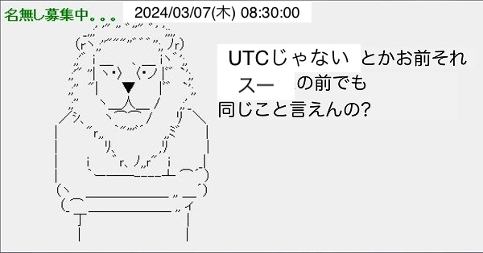

<!-- https://qiita.com/takeshisakuma/items/5a61e6eac123d28602fb -->
# 雰囲気実装を少し抜け出そう！RFCからPHPの実装までを考えるタイムゾーンとサマータイム！！！

---

<!-- _class: lead -->
<!-- _footer: "" -->
<!-- _paginate: "" -->

# 自己紹介

---


### 所属

株式会社TechBowl

### 住んでるところ

東京

### 何やってる？

「TechTrain」というサービスで反復横跳びし続けている何でも屋さん(Laravel, Next.js, AWS, etc...)

### 趣味

 - お酒(よく溺れる)
 - サウナ
 - 読書

---

## TechTrain


エンジニア教育+Directスカウトのサービス。
Coding Stoicをテーマに「うるせえコードかけ！」と言いがちなメンターが多めのエンジニアを育てるためのサービスです。

---

# 一緒に働いてくれる人を探しています！

## 1. バックエンドエンジニア(Laravel + DDD)
## 2. フロントエンドエンジニア(Next.js with TypeScript)
## 3. TechTrainのメンター -> 筋がいい人なら教えたいぜ！

---

# なぜ発表しようと思ったのか？

---

# PHPの言語やWeb標準にディープダイブしたい

1. 巨人の肩に乗るためには標準を知った方が良さそう
2. 歴史を遡っていけばいいんじゃないか
3. 言語の経緯を知った方がより良いコードが書けるのではないか

---

# さて！

---

# 雰囲気実装を少し抜け出そう！RFCからPHPの実装までを考えるタイムゾーンとサマータイム！！！

---

timezoneやサマータイムとOSやRDBは切っても切り離せない関係にあるといえますので、事前に前提を決めます。

---

# 前提

1. DB: MySQL 8.x
2. OS: Linux
3. WebサーバーとDBサーバーは分かれている

---

# タイムゾーン

---

# こんな実装を雰囲気でやっていませんか？

---


```php
<?php

declare(strict_types=1);

namespace App\Models;

use Illuminate\Database\Eloquent\SoftDeletes;

final class User extends Model
{
    use SoftDeletes;

    protected $fillable = [
        'name',
        'email',
        'created_at',
        'updated_at',
        'deleted_at',
    ];

    protected $casts = [
        'deleted_at' => 'timestamp', // or datetimeとかかもしれない
    ];
}
```

<!-- 論理削除については、け、決してそーだいさんに喧嘩を売っているわけではございません・・・！一般論として論理削除の実装が多いため、わかりやすさの担保としてサンプルコードとして入れているだけです -->

---

```php
$user = User::find(1)
$user?->deleted_at?->format('Y-m-d H:i:s');
```
---

# タイムゾーンの雰囲気実装

```php
<?php

$user = User::find(1);
$user?->deleted_at?->format('Y-m-d H:i:s'); // ← 問題がある
```

---

# 雰囲気実装にならないために考慮すべきこと

---

1. どこからその日時は取得されているか把握する
2. Databaseの日時の型を把握する
3. タイムゾーンの設定はどこで行われていて、どのタイムゾーンかを把握する
4. フロントエンドにレスポンスする際にはどのような形式の文字列に変換すべきか把握する

---

# 1. どこからその日時は取得されているか把握する

---

# 1. どこからその日時は取得されているか把握する

|リソース|取得元|
|:---:|:---|
|Webサーバー|Webサーバーのシステムクロック|
|DBサーバー|DBサーバーのシステムクロック|

システムクロックはUTCでタイムゾーンの情報は持たない

<!-- PHPで取得している場合は、WEBサーバーのシステムクロックからの取得。DatabaseではDBサーバーのシステムクロックからの取得 -->

---

# 2. Databaseの日時の型を把握する

1. timestamp型
2. datetime型

---

|データ型|NOT NULL制約|DEFAULT値|
|:--|:--|---|
|DATETIME|なし|NULL
|TIMESTAMP(~5.7)|あり|テーブル内で1つ目の定義：<br />CURRENT_TIMESTAMP ON UPDATE CURRENT_TIMESTAMP<br />テーブル内で2つ目以降の定義：<br />'0000-00-00 00:00:00'
|TIMESTAMP(8.0~)|なし|NULL

UTCで運用する前提であれば、2038年問題を回避するので、DATETIMEが良い
Laravelだとデフォルトのmigrationがtimestampになっているため、注意が必要。

---

# 3. タイムゾーンの設定はどこで行われていて、どのタイムゾーンかを把握する

---

タイムゾーンの設定可能箇所というのは次のとおり

1. php.iniの`date.timezone`
2. DBサーバー自体のタイムゾーン設定
3. MySQLの`my.cnf`における`default-time-zone`

この3つのどれから取得されているのか？を見た方が良い
PHPは、タイムゾーンをOSから取得されていない点も注意が必要

---

# 4. フロントエンドにレスポンスする際にはどのような形式の文字列に変換すべきか把握する

---

# ISO8601(RFC3339)

コメントに入ってるのは、Carbonの該当形式への変換を行うメソッド名

```
2018-08-07T10:55:33Z // `toIso8601ZuluString` <- UTCとして全て取り扱う場合
2018-08-07T19:55:33+09:00 // `toIso8601String` <- JSTなどを取り扱う場合
```

<!-- RFC3339 で -->

---

### 明示的にタイムゾーンを指定する場合は次のような形式が良い

```php
<?php

// ↓実際のレスポンス加工のロジック----
// or 'Asia/Tokyo'などが入る。
$timezone = DateTimeZone::ASIA;
$user = User::find(1);
$user->deleted_at
    // @var DateTimeZone|string $timezone
    ->setTimezone($timezone)
    ->toIso8601String();
```

---

# タイムゾーンの実装をちゃんとやると

1. 全体的にUTCに日時を合わせる
2. MySQLの日時の型は、datetime型を使う

上記に加えて次のように実装を行う。

---

## Model

```php
<?php

declare(strict_types=1);

namespace App\Models;

use Illuminate\Database\Eloquent\SoftDeletes;

final class User extends Model
{
    use SoftDeletes;

    protected $fillable = [
        'name',
        'email',
        'created_at', // datetime
        'updated_at', // datetime
        'deleted_at', // datetime
    ];

    protected $casts = [
        'deleted_at' => 'datetime',
    ];
}
```

---

## レスポンスの際の実装

```php
$user = User::find(1)
// UTCのみ取り扱う場合
$user?->created_at->toIso8601ZuluString();
// JSTなどを取り扱う場合(すでにtimezoneは設定済み)
$user?->created_at->toIso8601String();
```

---

# サマータイムとは

---

# サマータイムとは

1. 太陽の出ている時間帯を有効に利用することを目的として、欧米を中心に導入
2. 日の出時刻が早まる時期（3月～11月）に、時計の針を1時間進め、時期が終われば、1時間戻す

---

# 実施地域

1. ヨーロッパでは2019年に欧州連合で夏時間の廃止の法案が可決された
2. 2021年を持ってサマータイムが終了する予定だったが、現時点で廃止できていない

---

# サマータイムの実施タイミング

バラバラ。しかも前の年くらいまで決まらない。

---

## アメリカ

3月の第2日曜日午前2時に、1時間時計の針を進めて夏時間にする。11月の第1日曜日午前2時に、1時間時計の針を元に戻す。

## ヨーロッパ諸国

3月の最終日曜日午前1時に時計の針を進め、10月の最終日曜日午前1時に時計の針を元に戻す。

## ニュージーランド

9月の最終日曜日午前2時に時計の針を進め、4月の第1日曜日午前3時に時計の針を元に戻す。

---

# サマータイムに入る時、何が起こっているのか。

|見た目|実際の処理|
|:---:|:--|
|時計が1時間進む|**"オフセット"** が動いている|

---

# サマータイムはオフセットが動いている！

---

# サマータイムはオフセットが動いている！

## これテストに出ます・・・！

---

# 仮に日本でサマータイムに入る時(3月)

```diff
- 2024-03-07T00:00:00Z+09:00
+ 2024-03-07T00:00:00Z+10:00
```

---

# 仮に日本でサマータイムが終わる時(11月)

```diff
- 2024-03-07T00:00:00Z+10:00
+ 2024-03-07T00:00:00Z+09:00
```
---

# サマータイムの処理についてまとめ

1. サマータイムに入る時オフセットが +1時間
2. サマータイムが終わる時には、オフセットが -1時間
3. **tz databaseと呼ばれるデータに開始と終了の情報が集約**

---

# サマータイムの影響を受ける処理について

1. 指定時刻に起動する処理
2. タイムスタンプから経過時間を計算する処理
3. 同じタイムスタンプが二重で存在するようになってしまう

---

# 1. 指定時刻に起動する処理

---

# 1. 指定時刻に起動する処理

**実は、cron, crondはサマータイム対応済み**なので、内部的に利用されている場合は問題なし。
3時間以内の変更であれば、吸収してくれます。

[引用元](https://web.archive.org/web/20130905110602/http://unixhelp.ed.ac.uk/CGI/man-cgi?cron+8)

---

# 例えば午前3時に起動する処理があると仮定

---

# サマータイム開始時

**サマータイムに午前2時59分59秒に入るとして4時に変更される場合**

午前3時が存在しないが、サマータイムになって時間が午前4時になった瞬間に即実行される

---

# サマータイム終了時

**サマータイムから午前3時に戻るとして午前2時に変更される場合**

午前3時が2回来るが、2回目は実行されない

---

# 2. タイムスタンプから経過時間を計算する処理

出社時刻と退勤時刻を記録し、勤務時間を計算するようなアプリケーションを考えてみる。

---

# サマータイム開始時

**3/11 09:00に出社し、3/12 03:00（サマータイムでの午前5時）に退勤した場合**

実際の勤務時間は18時間だが、サマータイム非対応のアプリケーションでは20時間と計算される。

---

# サマータイム終了時

逆に18時間勤務なのに、16時間となってしまう。

---

# 対応方法

**UTCに変換して計算する**

---

# なぜこの対応方法なのか？

---

# なぜこの対応方法なのか？

## サマータイムがオフセットをずらす処理であるから

---

# 3. 同じタイムスタンプが二重で存在してしまう

---

# 対応方法

---

# 対応方法

### 保存時にUTCで必ず保存する

そもそもtimezoneの日時のまま保存するな！ということ

---

# サマータイム対応方法まとめ

1. cron(crond)はサマータイム対応済みであるため、対応はcron(crond)に任せる
2. 日時の計算はUTCで行う
3. 保存時にUTCで保存する

---

# 僕との約束（本日のまとめ）

1. 日時の取り扱い、計算は全てUTCだ！絶対だぞ！
2. timezoneの設定も全てUTCだ！絶対だぞ！
3. MySQLの型はdatetimeだ！timestampは使うな！

---




<!-- (t-wadaさんを尊敬しているため、利用させてもらっております・・・) -->

---

# ご清聴ありがとうございました！

## 話しかけるの苦手で、話しかけてもらえるととても嬉しいです！

---

# おまけ

---

# 豆知識

サマータイムは別名 Daylight Saving Time(DST)とも呼ばれるため、変数名が`$dst`とかになっていることがある。

---

# Carbonではなく、PHPの標準でタイムゾーンのサマータイムかどうかを判定する

## その1

```php
<?php

if (date('I', time())) {
    echo 'We are in DST!'
} else {
    echo 'We are not in DST!'
}
```

---

# Carbonではなく、PHPの標準でタイムゾーンのサマータイムかどうかを判定する

## その2

```php
<?php

function timezone($timezone = 'Asia/Tokyo') {
    $timezone = new DateTimeZone($timezone);
    $transitions = $timezone->getTransitions();
    $trans = null;

    if (is_array($transitions)) {
        foreach ($transitions as $k => $t) {
            // 今年を求めている
            if (substr($t['time'], 0, 4) === date('Y')) {
                $trans = $t;
                break;
            }
        }
    }

    return $trans !== null ? $trans : false;
}

$timezone_data = timezone();
print_r($timezone_data);
```

---

# [こちら](./phper-kaigi-2024-omake.md)に調査時などの走り書きを入れています