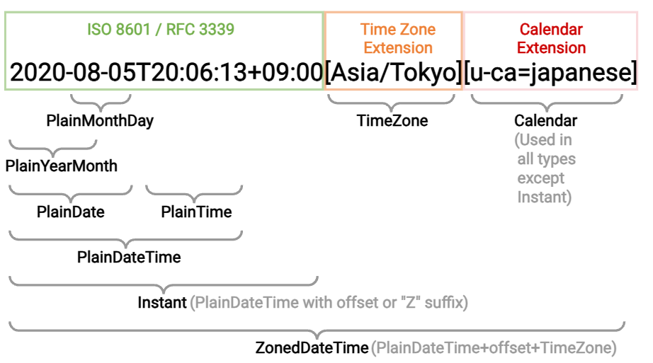

<!-- https://qiita.com/takeshisakuma/items/5a61e6eac123d28602fb -->
# 雰囲気実装を少し抜け出そう！RFCからPHPの実装までを考えるタイムゾーンとサマータイム！！！

---

<!-- _class: lead -->
<!-- _footer: "" -->
<!-- _paginate: "" -->

# 自己紹介

---


### 所属

株式会社TechBowl

### 住んでるところ

東京

### 何やってる？

「TechTrain」というサービスで反復横跳びし続けている何でも屋さん(Laravel, Next.js, AWS, etc...)

### 趣味

 - お酒(よく溺れる)
 - サウナ
 - 読書

---

## TechTrain


エンジニア教育+Directスカウトのサービス。
Coding Stoicをテーマに「うるせえコードかけ！」と言いがちなメンターが多めのエンジニアを育てるためのサービスです。

---

# 一緒に働いてくれる人を探しています！

## 1. バックエンドエンジニア(Laravel + DDD)
## 2. フロントエンドエンジニア(Next.js with TypeScript)
## 3. TechTrainのメンター -> 筋がいい人なら教えたいぜ！

---

# なぜ発表しようと思ったのか？

---

# PHPの言語やWeb標準にディープダイブしたい

1. 巨人の肩に乗るためには標準を知った方が良さそう
2. 歴史を遡っていけばいいんじゃないか
3. 言語の経緯を知った方がより良いコードが書けるのではないか

---

# さて！

---

# 雰囲気実装を少し抜け出そう！RFCからPHPの実装までを考えるタイムゾーンとサマータイム！！！

---

timezoneやサマータイムとOSやRDBは切っても切り離せない関係にあるといえますので、事前に前提を決めます。

---

# 前提

1. DB: MySQL 8.x
2. OS: Linux
3. WebサーバーとDBサーバーは分かれている

---

# タイムゾーン

---

# こんな実装を雰囲気でやっていませんか？

---


```php
<?php

declare(strict_types=1);

namespace App\Models;

final class User extends Model
{
    protected $fillable = [
        'name',
        'email',
        'created_at',
        'updated_at',
        'deleted_at',
    ];

    protected $casts = [
        'deleted_at' => 'timestamp', // or datetimeとかかもしれない
    ];
}
```

---

```php
$user = User::find(1)
$user?->deleted_at?->format('Y-m-d H:i:s');
```

---

こんな実装を何も考えずにやるのではなく、
もうちょっと意識することを増やしませんか？という話をします。

---


# タイムゾーンの雰囲気実装
## 何がダメなのか？

```php
<?php

$user = User::find(1);
$user?->deleted_at?->format('Y-m-d H:i:s'); // ← ここでタイムゾーンの情報が削ぎ落とされている+どこのタイムゾーン？
```

チームとしてUTCで決めているよーとか答えられるのであれば、問題が少ないかもしれませんが、よろしくはないですね。

---

# 雰囲気実装にならないために考慮すべきこと

---

1. どこからその日時は取得されているか把握する
2. Databaseの日時の型を把握する
3. タイムゾーンの設定はどこで行われていて、どのタイムゾーンかを把握する
4. フロントエンドにレスポンスする際にはどのような形式の文字列に変換すべきか把握する

---

# 1. どこからその日時は取得されているか把握する

---

# WEBサーバーの場合

WEBサーバーのシステムクロック

---

# DBサーバーの場合

DBサーバーのシステムクロック

---

## Q. 正確な日時が必要とされるシステムではどうするのか？
## A. NetworkTimeProtocol (NTP)を使って、時刻同期を行う

- 上記については意識的に行いつつ、精度を確認するための仕組みを提供しているベンダーもある
  - AWSの場合は、Amazon Time Sync Service

---

# 2. Databaseの日時の型を把握する

1. timestamp型
2. datetime型

---

|データ型|NOT NULL制約|DEFAULT値|
|:--|:--|---|
|DATETIME|なし|NULL
|TIMESTAMP(~5.7)|あり|テーブル内で1つ目の定義：<br />CURRENT_TIMESTAMP ON UPDATE CURRENT_TIMESTAMP<br />テーブル内で2つ目以降の定義：<br />'0000-00-00 00:00:00'
|TIMESTAMP(8.0~)|なし|NULL

UTCで運用する前提であれば、2038年問題を回避するので、DATETIMEが良い
Laravelだとデフォルトのmigrationがtimestampになっているため、注意が必要。

---

# 3. タイムゾーンの設定はどこで行われていて、どのタイムゾーンかを把握する

---

タイムゾーンの設定可能箇所というのは次のとおりです


1. Webサーバー自体のタイムゾーン設定
2. php.iniの`date.timezone`
3. DBサーバー自体のタイムゾーン設定
4. MySQLの`my.cnf`における`default-time-zone`

つまりこの4つのどれから取得されているのか？を意識する必要があります。

---

# 4. フロントエンドにレスポンスする際にはどのような形式の文字列に変換すべきか把握する

---

# ISO8601

コメントに入ってるのは、Carbonの該当形式への変換を行うメソッド名

```
2018-08-07T10:55:33Z // `toIso8601ZuluString` <- UTCとして全て取り扱う場合
2018-08-07T19:55:33+09:00 // `toIso8601String` <- JSTなどを取り扱う場合
```

---

### 明示的にタイムゾーンを指定する場合は次のような形式が良い

```php
<?php

// ↓実際のレスポンス加工のロジック----
// or 'Asia/Tokyo'などが入る。
$timezone = DateTimeZone::ASIA;
$user = User::find(1);
$user->deleted_at
    // @var DateTimeZone|string $timezone
    ->setTimezone($timezone)
    ->toIso8601String();
```

---

# タイムゾーンの実装をちゃんとやると

1. 全体的にUTCに日時を合わせる
2. MySQLの日時の型は、datetime型を使う

上記に加えて次のように実装を行う。

---

## Model

```php
<?php

declare(strict_types=1);

namespace App\Models;

final class User extends Model
{
    protected $fillable = [
        'name',
        'email',
        'created_at', // datetime
        'updated_at', // datetime
        'deleted_at', // datetime
    ];

    protected $casts = [
        'deleted_at' => 'datetime',
    ];
}
```

---

## レスポンスの際の実装


```php
$user = User::find(1)
// UTCのみ取り扱う場合
$user?->created_at->toIso8601ZuluString();
// JSTなどを取り扱う場合(すでにtimezoneは設定済み)
$user?->created_at->toIso8601String();
```

---

# サマータイム

---

# 実装サンプルとしてありがちなやつの想定

1. サマータイムがない国の実装
2. サマータイムが進んで戻る際の実装の考慮がない実装(2回同じ日時が繰り返されるやつ)
3. タイムゾーン定義自体が永続的に変更される際の実装の考慮がない実装

---

# TODO

- [ ] RFCにおけるタイムゾーンについて調べる
- [ ] RFCにおけるサマータイムについて調べる
- [ ] RFCにおけるサマータイムを考えずにやりがちな実装パターンを考える
- [ ] RFCにおけるサマータイムから逆算した最適な実装パターンを考える
- [ ] 実装パターンにおけるアンチパターンから最適なパターンに切り替えていく方法を考える


---

日時の取得順

1. UTCの取得がPCにおいて行われる
2. システムの日時を言語の仕組みで取得する(PHPの場合は大体はDateTimeクラス)
3. 2で取得された値がオブジェクトとしてインスタンスが生成される
4. 3に加えて、タイムゾーンとサマータイムの考慮が入って変換が必要な場合は変換される

---

1. Carbonの場合
2. FactoryImmutable

---

1. Carbon::now()
2. DateTime
3. date_create
4. php_date_initialize
5. php_date_get_current_time_with_fraction+timelib_unixtime2local
6. gettimeofday(C言語の現在日時取得メソッド) - gettimeofday は POSIX に準拠した関数で、マイクロ秒単位の精度で現在の時刻 -　Windowsは別で取得用の処理が分かれています
7.


---

タイムゾーンがどう表現されているのか。についての説明

---

タイムゾーンの説明

---

# タイムゾーンの雰囲気実装

```php
<?php

declare(strict_types=1);

namespace App\Models;

final class User extends Model
{
    protected $fillable = [
        'name',
        'email',
        'created_at',
        'updated_at',
        'deleted_at',
    ];

    protected $casts = [
        'deleted_at' => 'timestamp', // or datetimeとかかもしれない
    ];
}
```

---

# タイムゾーンの雰囲気実装

```php
<?php

// ↓実際のレスポンス加工のロジック----
$user = User::find(1);
$user->deleted_at->format('Y-m-d H:i:s');
```

---


# サマータイムとは

---

[サマータイムの説明]

---

# 実施地域

ヨーロッパでは2019年に欧州連合で夏時間の廃止の法案が可決されました。2021年を持ってサマータイムが終了する予定でしたが、新型コロナウイルス感染症の流行により議論を進めることができず、現時点で廃止できていない。

---

# サマータイムの実施タイミング

バラバラ。しかも前の年くらいまで決まらない。

---

## アメリカ

3月の第2日曜日午前2時に、1時間時計の針を進めて夏時間にする。11月の第1日曜日午前2時に、1時間時計の針を元に戻す。

## ヨーロッパ諸国

3月の最終日曜日午前1時に時計の針を進め、10月の最終日曜日午前1時に時計の針を元に戻す。

## ニュージーランド

9月の最終日曜日午前2時に時計の針を進め、4月の第1日曜日午前3時に時計の針を元に戻す。

---

# サマータイムに入る時、何が起こっているのか。

見た目: 時計が1時間進みます
実際: 時刻ではなく "オフセット" が動いている

オフセットが +1 されて、サマータイムが終わる時には、オフセットが -1 される。

---

# 仮に日本でサマータイムに入る時

```git
- 2024-03-07T00:00:00Z+09:00
+ 2024-03-07T00:00:00Z+10:00
```

---

# 仮に日本でサマータイムが終わる時

```git
- 2024-03-07T00:00:00Z+10:00
+ 2024-03-07T00:00:00Z+09:00
```

---

# サマータイムの影響を受ける処理について

1. 指定時刻に起動する処理(cronはサマータイム対応済み)
2. タイムスタンプから経過時間を計算する処理
3. 同じタイムスタンプが2回存在する場合の処理

---

# 前提

(1) 3/11 2:00:00からサマータイムが始まる
(2) 11/4の2:00:00にサマータイムが終わる

上記を前提として考える。
タイムゾーンがいつからいつまでで、何時間ずらせばよいか、という情報は
tz databaseと呼ばれるデータに集約されている。

---

# 1. 指定時刻に起動する処理

---

**実は、cronはサマータイム対応済み**

  (1)のとき、
  例えば午前3時に起動する処理があった場合、
  午前3時が存在しないため、実行されるはずの処理が実行されない。

  (2)のとき、
  例えば午前1時に起動する処理があった場合、
  午前１時が1日に2回来るため、2回処理が実行されてしまう。

  (1)のときは、午前4時に午前3時に実行するはずだった処理を実行する。
  (2)のときは、２回目に訪れた午前1時には、処理が実行されない。

---

# 2. タイムスタンプから経過時間を計算する処理

出社時刻と退勤時刻を記録し、勤務時間を計算するようなアプリケーションを考えてみる。

---

# (1)のとき

3/11 午前9時に出社し、3/12の午前3時（サマータイムでの午前5時）に退勤した場合、
実際の勤務時間は18時間だが、サマータイム非対応のアプリケーションでは20時間と計算される。

---

# (2)のとき

逆に16時間となってしまう。

こうした処理は以下の手順で勤務時間を計算するのが一般的と思われる。

* 出社時刻と退勤時刻をそれぞれUNIX時間に変換する
* 退勤時刻のUNIX時間 － 出社時刻のUNIX時間 ＝ 勤務時間

この処理でOKになるのは、サマータイムがオフセットをずらす処理であるから。

---

サマータイムに対応させるためには、一度サマータイムを持たないUTCに変換することで対応する。
* 出社時刻、退勤時刻を、UTCに変換する。
* UTCに変換した出社時刻、退勤時刻をUNIX時間に変換する。
* 退勤時刻のUNIX時間 － 出社時刻のUNIX時間 ＝ 勤務時間

---

# 3. 同じタイムスタンプが2回存在する場合の処理

---

## (2)のときのみ起こるため、(2)のときのみ考える

---

TODO: SummerTimeでoffsetを戻った時の処理を考える

---

# TODO
wall-clock time とetを区別できていない実装のサンプルを出す

---

## RFCにおけるサマータイムについて調べる

1. wall-clock time（ローカル時間 や clock time とも呼ばれる、タイムゾーンに依存した時刻）
2. exact time（UTC 時間 とも呼ばれる、地球上のどこでも同じ時刻）を区別すること

---

Coordinated Universal Time （UTC）は、世界が時計と時刻を調整、規制するための時間の基準です。
これは、経度 0 度における平均太陽時から 1 秒以内のものであり、サマータイムによる調整は行われていません。
これは実質的にグリニッジ標準時（GMT）の後継です。
サマータイムの調整が行われているのは、wall-clock timeのみ。

---

# ご清聴ありがとうございました！

---

---

ISO 8601とRFC3339は特定の時刻と時間を表現するための標準規格です。例：2020-09-06T17:35:24.485Z。ここで Z は UTC を表す接尾辞です。

https://ja.wikipedia.org/wiki/ISO_8601
https://datatracker.ietf.org/doc/html/rfc3339

---

# そもそもtimestampって何？

---

以前は、夏時間の期間に入るまたは終わる度に手動でコンピュータに内蔵されている時計の時刻を合わせていたが、近年のオペレーティングシステムは、自動的に内蔵時計を修正する機能をもっている。ファイルのタイムスタンプの扱いは、使用するファイルシステムおよびオペレーティングシステムによって異なる。

---

例えば、FATのようなタイムスタンプの記録にローカルタイムを利用するファイルシステムの場合、夏時間内で修正されたファイルを、夏時間外で読み込んだ場合、時刻が1時間ずれる。一方、NTFSのような、タイムスタンプを協定世界時（UTC）で記録するファイルシステムを利用している場合、このような問題は起きない。

時刻の内部管理にUTCを使うことにより、夏時間を意識せずにファイルの読み書きができるものの、オペレーティングシステム上での取り扱いは、各システムによって異なる。

---

Laravelだとすればdefaultはtimestamp型のカラムになっているので、そうしますが、実は問題があります。
そう2038年問題です。

---

2038年以降については動作が保証されないため、datetime型で雰囲気UTCを前提で使うことになります。

---

# Windows系の場合

FATのようなタイムスタンプの記録にローカルタイムを利用するファイルシステムであるため、
Windows XP以前のOSでは、時刻は現在有効な標準時に合わせて表示される。
例えば、夏時間の期間中にタイムスタンプが9時であった場合、期間外では10時と表記される。
この方式では表示される時刻が実際の時刻と異なることがある。一方で、夏時間の期間の前後で時刻に不連続が発生しなくなるという利点がある。また、時代・地域による期間・調整時間の差異や、未来の時刻を取り扱う時に実施当日までに変更される可能性がある夏時間規則を考慮する必要がない。

# WindowsでもWindows 7以降およびmacOSの場合

NTFSのような、タイムスタンプを協定世界時（UTC）で記録するファイルシステムを利用しているため、
期間中に9時であったものは、期間外になっても9時と表記される。この方式の利点・欠点は前者の逆である[84]。

---

LinuxやBSD系オペレーティングシステムではtz databaseを用いて夏時間を管理している。

デジタルカメラなどの画像ファイルで使われるEXIFではGPS関連の項目を除いてUTCやタイムゾーンなどは考慮されていない。このため、夏時間を採用している地域では、画像を読み込む時期によって撮影時刻の記録・表示が1時間ずれる。

---

# タイムゾーンオフセットの変更とサマータイムを理解する
タイムゾーン は UTC と wall-clock がどのように関連しているかを定義します。
タイムゾーンは、exact time を受け取って UTC オフセットを返す関数、および反対方向への変換に対応する関数と考えられます。
（なぜ exact -> local の変換は 1 対 1 なのに、local -> exact への変換は曖昧なのかの理由は後述します）。

IANA Time Zone Database（TZ database とも呼ばれる）を使用します。
これは、タイムゾーン関数の世界的なリポジトリであると考えられます。各 IANA タイムゾーンは以下のものを持ちます：

time zone ID は、地理的な範囲を市などで表したものです（例）。例えば Europe/Paris、Africa/Kampala などです。また、1 つのタイムゾーンオフセットも表すこともできます。例えば UTC（+00:00 オフセットの定数）や Etc/GMT+5（歴史的な経緯でこれは-05:00の意味）
タイムゾーンオフセット定義 は、すべての UTC のオフセットのデータベースで、1970 年 1 月 1 日からのすべての情報が記載されています（例）。これは、ある UTC の範囲（未来の範囲も含まれる）を特定のオフセットに写像するテーブルであると考えられます。いくつかのタイムゾーンは、オフセットが一時的に変わったりすることがあります。例えば サマータイム が導入されていると、春の初めと秋の終わりでオフセットが年に 2 回も変更されます。オフセットは、国がタイムゾーンを変更するように決定するなどの、政治的な理由で恒久的に変更される場合もまたあります。
TZ データベースは世界の政治的な変化によって年に数回アップデートされます。各アップデートにはタイムゾーン定義の変更が含まれます。これらの変更は通常は未来の date/time 値にのみ影響するものです。しかし、ごくまれに過去の範囲が修正されることもあります。例えば、20 世紀初頭の計時に関する新たな歴史的資料が発見された場合などです。

---

# Time Zone Databaseにより定義された各タイムゾーン

場合によってはUTCからの時間の差分（協定世界時との差）を複数持つ
典型的には、標準時と夏時間双方が同一のタイムゾーンに含まれる。

---

# 考慮しなくてはいけないパターン

1. サマータイムでずれた時のインサートなどの日時の取り扱い
2. タイムゾーン自体が政治的な問題でずれてしまった時の取り扱い

---

# サマータイムに入る時、何が起こっているのか。

見た目: 時計が 1 時間進みます
実際: 時刻ではなくオフセットが動いている

オフセットが+1されて、サマータイムが終わる時には、オフセットが-1される。

---

# 仮に日本でサマータイムに入る時

```git
- 2024-03-07T00:00:00Z+09:00
+ 2024-03-07T00:00:00Z+10:00
```

---

# 仮に日本でサマータイムが終わる時

```git
- 2024-03-07T00:00:00Z+10:00
+ 2024-03-07T00:00:00Z+09:00
```

---

# ここから先は調査の際の走り書きであるため、見たい人だけみてね。

---

うるう秒なくなったよーの話も面白いかもしれない。
Googleの謎技術の話w
1秒を薄めていくやつ

---

1. 各国の標準時のもとになる「協定世界時（UTC）」も、世界中にある400台以上の原子時計の進み具合を平均する
2. うるう秒は、そんなUTCと地球の自転に基づく時刻が、大きくずれないよう合わせるためのものだ。
3. 具体的には時間差が0・9秒を超えそうになったとき、UTCを1秒分調整する。精密な原子時計と地球の自転速度のムラの「つじつま合わせ」とも言える。
4. 似たような言葉に「うるう年」があるが、根本的に違う。
5. うるう年は地球が太陽の周りをまわる公転周期が365日より若干長いことから、ほぼ4年に1回、規則的にくる。一方、うるう秒は、不規則なうえ、半年前にしか分からない。

　毎回、地球の自転を観測する国際機関が調整のタイミングを決める。それを受けて、日本では標準時を管理する情報通信研究機構（NICT）などが周知や通報にあたる。これまでに27回、直近だと17年にあった。


1972年に閏秒は導入されている。

---

# POSIX とは

POSIX (Portable Operating System Interface) は、UNIX 系 OS 間でアプリケーションの移植性を高めるために定義された IEEE の標準規格です。簡単に言うと「OS の互換性のための標準規格」です。

---

### 参考リンク

https://tc39.es/proposal-temporal/docs/ja/ambiguity.html
https://ja.wikipedia.org/wiki/Tz_database
https://tex2e.github.io/rfc-translater/html/rfc5545.html
https://zenn.dev/mpyw/articles/laravel-datetimezone-best-practices
https://zenn.dev/pixiv/articles/23b726da2236cd
https://datatracker.ietf.org/doc/draft-ietf-sedate-datetime-extended/
https://tc39.es/proposal-temporal/docs/strings.html#machine-readable-string-persistence-overview
https://qiita.com/yamato225/items/676beef96efb8751e581
https://www.casio.com/jp/watches/contents/daylight-saving/
https://zenn.dev/mpyw/articles/laravel-datetimezone-best-practices
https://dev.mysql.com/doc/refman/8.0/ja/datetime.html
https://mysql.sql55.com/sql/mysql-now-curdate.php#:~:text=MySQL%20%E3%81%A7%E7%8F%BE%E5%9C%A8%E3%81%AE%E6%97%A5%E6%99%82%E3%82%92%E5%8F%96%E5%BE%97%E3%81%99%E3%82%8B%E3%81%AB%E3%81%AF,%E6%96%87%E5%AD%97%E5%88%97%E3%81%A8%E3%81%97%E3%81%A6%E8%BF%94%E3%81%97%E3%81%BE%E3%81%99%E3%80%82
https://tech.hajimari.inc/entry/2022/09/05/100000


---

# ライブラリ候補

https://github.com/brick/date-time
https://github.com/briannesbitt/Carbon
https://github.com/fre5h/datetime-php
https://github.com/aeon-php/calendar

---

# まとめ

|種類|内容|
|:--|---|
|||
|||

---

# ご静聴ありがとうございました！

## 話しかけるの苦手で、話しかけてもらえるととても嬉しいです！

---

# おまけ

---

# 新たな Date/Time Format が来るかもしれない

---

# Internet Extended Date/Time Format (IXDTF)

[RFC Draft: Date and Time on the Internet: Timestamps with additional information](https://datatracker.ietf.org/doc/draft-ietf-sedate-datetime-extended/) にて新たに Internet Extended Date/Time Format (IXDTF) が提案されている。

---

# 要点

1. RFC 3339 の Internet Date/Time Format にタイムゾーンと、キーバリューペアを持つタグを付加できるようになる
2. 2024/03/07現在、まだDraftとなっている
3. 2のこともあり、まだPHPもCarbonも未対応

※ECMAScriptのTemporalはすでに仕様の議論に入っている模様。

---

## 全体構造



---

# [Draftである理由](https://datatracker.ietf.org/doc/review-ietf-sedate-datetime-extended-08-opsdir-lc-clarke-2023-06-12/)

```python
from datetime import datetime
datetime.fromisoformat("2022-07-08T00:14:07Z[!Europe/London]")
Traceback (most recent call last):
  File "<stdin>", line 1, in <module>
ValueError: Invalid isoformat string: '2022-07-08T00:14:07Z[!Europe/London]'
```

Pythonの例が記述されており、このように移行のための対応が言語やライブラリでなされるまで、移行自体に問題が出る可能性があるため、ドキュメント自体に移行についての記述がなされるまでは、「Has Issues」のステータスとして取り扱われている。

---

# タイムゾーンとは

---

# タイムゾーンとは

* 地球上の異なる地域で標準時を基準にした時間帯を指す
* 地球は24時間で一周するため、世界を24の時間帯に分ける
* 標準時または協定世界時（UTC）を基準とする

---

# そもそもなぜタイムゾーンが必要とされたのか？

---

# そもそもなぜタイムゾーンが必要とされたのか？

1. 19世紀後半に鉄道の旅や通信技術の進歩に伴って生じた、地域ごとの時刻の違いによる混乱に対処するためだった
2. タイムゾーンが導入される以前は、各都市や町は太陽の位置を基準にした独自の現地時間を持っていた
3. そのため、異なる場所でのイベントのスケジュールや調整が困難だった
